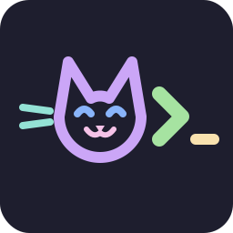

  
  <h1>PurrPrompt</h1>

  
  

Bash relies on synchronous evaluation of `PS1` and `PROMPT_COMMAND`. Unlike Zsh, which supports asynchronous worker threads, or Fish, which has native async capabilities, extending Bash visually often blocks the input loop during heavy I/O operations. This architectural limitation typically forces users toward compiled cross-shell binaries (like Starship) to manage execution overhead, or heavy Zsh frameworks (like Powerlevel10k). 

PurrPrompt is a native Bash implementation that utilizes raw ANSI escape sequences and state management to deliver high-density data and visual hierarchy without external binary execution for prompt rendering. It strictly adheres to the Catppuccin Mocha palette.

---

## 

- **Pure Bash Execution:** Prompt rendering relies entirely on `PROMPT_COMMAND` array execution and variable assignment. Zero external binary calls are made for the prompt string assembly itself.
- **Palette Compliance:** Hardcoded ANSI sequences mapped exactly to Catppuccin Mocha hex values.
- **State Management (`__PURR_STATE`):** Implements a state machine to track terminal clearing events (`clear`), preventing duplicate visual separators or `\n` artifacts that plague standard multiline Bash prompts.
- **Synchronous Git Parsing:** Evaluates `git rev-parse` and `git status --porcelain` to indicate branch and dirty state via Nerd Font glyphs.
- **Execution Code Hook:** Captures `$?` prior to prompt rendering to toggle the prompt arrow color (Success/Failure).

## 

* `bash` (v4.0 or higher recommended for associative array support if expanded in the future)
* `git` (Accessible in `$PATH` for repository status)
* `fastfetch` (For the initial session initialization banner)
* A patched [Nerd Font](https://www.nerdfonts.com/) configured in your terminal emulator (e.g., JetBrainsMono NF).

## 

This project is licensed under the [MIT License](https://mit-license.org/).