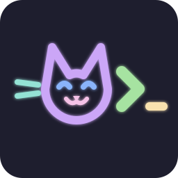

<div align="center">
  
  <h1>PurrPrompt</h1>

  <p>A high-performance, zero-latency Bash prompt with a premium Catppuccin Mocha aesthetic.</p>

  

</div>

---

<h2 align="center">
  
</h2>

<div align="center">
  <!-- Add your screenshots or GIFs here! -->
  <p><i>Images yet to be added</i></p>
</div>

---

<h2 align="center">
  
</h2>

| Category | Features |
| :--- | :--- |
| **✿ Aesthetics** | **Catppuccin Mocha** palette <br> • Rounded powerline caps <br> • Nerd Font icons <br> • Seamless data bar <br> • Fresh launch `fastfetch` or `pfetch` integration |
| **⌬ Intelligence** | **Git integration** (dirty state detection) <br> • **Millisecond-precision command timing** <br> • **Background jobs** count <br> • **Exit code** badges |
| **☇ Performance** | **Pure Bash** (no subshells/binaries) <br> • **Zero-Redraw Autocomplete** <br> • State-managed prompt clearing |
| **⌨ Workflow** | Prefix-based **history search** (`Up`/`Down`) <br> • Case-insensitive **tab completion** <br> • Clean single-row autocomplete interface <br> • **Smart spacing** between commands (with native `CTRL+L` support) |

---

<h2 align="center">
  
</h2>

Quick setup to get PurrPrompt running in your terminal:

```bash
# 1. Clone the repository
git clone https://github.com/AKRiLLiCK/purrprompt.git && cd purrprompt

# 2. Source in your .bashrc
echo "source $(pwd)/.bashrc" >> ~/.bashrc

# 3. Reload your shell
source ~/.bashrc
```

> [!NOTE]
> Requires a [Nerd Font](https://www.nerdfonts.com/) for icons and glyphs to render correctly

---

<h2 align="center">
  
</h2>

Distributed under the [MIT License](https://mit-license.org/)